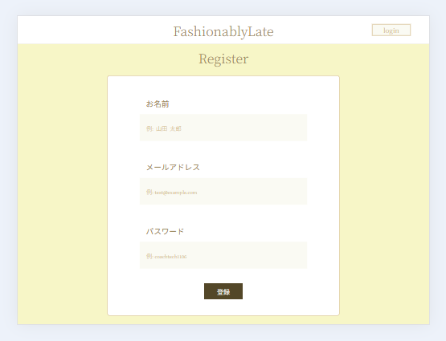
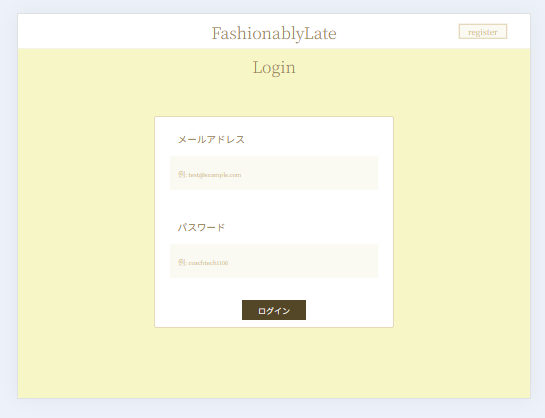
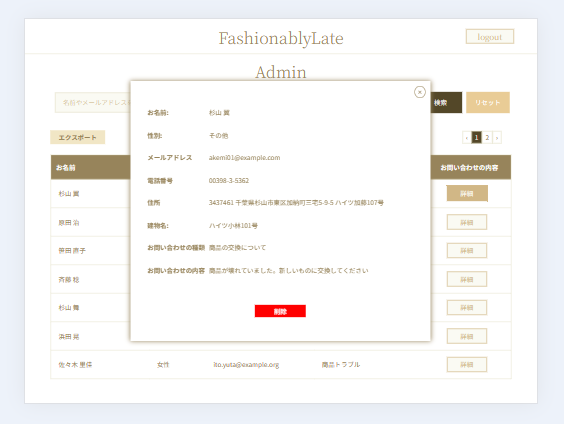

<p align="center">        </p>

###お問い合わせフォーム
###お問い合わせフォーム管理システムアプリ

<p align="center">
  
</p>

<p align="center">
  
</p>

<p align="center">
  
</p>

### 機能要件

- **お問い合わせフォーム**：
  - お問い合わせフォーム入力後、確認画面ボタンクリックすると確認画面へ遷移。
  - FormRequest を使用してバリデーションを行う。
  - 送信ボタンと修正ボタン実装。
  - 送信ボタンをクリックすると、サンクスページへ遷移する。
  - サンクスページには中央に「HOME ボタン」があり、これをクリックするとお問い合わせフォーム入力ページへ遷移する。
- **認証機能**: Fortify を使用し、管理画面にアクセスできる新規ユーザーを作成。
- **バリデーション**: 登録とログインの際に FormRequest を使用してバリデーションを行う。
- **検索機能**: 名前での検索、メールアドレスでの検索、性別での検索、お問い合わせ種類での検索、日付での検索ができる。
  - 検索欄に全て入力・選択をしなくても検索可能
  - 入力フォームは部分一致と完全一致検索が可能
  - 性別検索では「全て」と「男性」、「女性」、「その他」から検索が可能
  - 日付はカレンダーを使用して検索可能
  - 「リセット」ボタンをクリックすると検索ページが初期状態に戻る
  - ページネーションを使用し、7 件ごとのデータを表示
- **エクスポート機能**：「エクスポート」ボタンのクリックでデータを CSV 形式でエクスポートできる。
  - 検索を絞り込んだ状態で「エクスポート」ボタンを押すと絞り込んだ分でエクスポート可能
- **詳細表示機能**:「詳細」ボタンのクリックでデータの詳細が表示される
  - 詳細の表示はモーダルウィンドウを使用。
  - 「削除」ボタンをクリックするとデータが削除できる。
  - モーダルウィンドウ右上の「×」マークのクリックで詳細画面が閉じる

### 作業範囲

- 設計
- コーディング
- テスト

### システム要件

- **オペレーティングシステム**: Windows11
- **開発言語**: PHP
- **フレームワーク**: Laravel
- **データベース**: MySQL
- **バージョン管理**: GitHub

### 使用技術

- **フロントエンド**: HTML, CSS
- **バックエンド**: PHP, Laravel
- **データベース**: MySQL
- **バージョン管理**: Git, GitHub

### ライセンス

このプロジェクトは特定のクライアントにのみ提供される専用のソフトウェアです。再配布や商用利用は禁止されています。

#### 使用技術（実行環境）

- **開発言語**: PHP
- **フレームワーク**: Laravel 8.x
- **データベース**: MySQL
- **バージョン管理**: GitHub
- **コンテナ化技術**: Docker

#### ER 図


#### 環境構築

- **PHP**: 8.3.6
- **MySQL**: 10.3.39
- **Composer**: 2.7.7
- **Docker**: 27.4.0
- **Laravel Framework**: 8.83.27

- ＊ご使用の PC に合わせて各種必要なファイル(.env や docker-compose.yml 等)は作成、編集してください。

- **1.docker-compose exec bash**
- **2.composer install**
- **3..env.example ファイルから.env を作成し、環境変数を変更**
- **4.php artisan key:generate**
- **5.php artisan migrate**
- **6.php artisan db:seed**

####クローン作製手順

1. GitHub リポジトリのクローン

```bash
git clone https://github.com/ponponmama/20240504-hara_erika-ability-test.git
```

```bash
cd 20240504-hara_erika-ability-test
```

2. 必要なパッケージのインストール

```bash
sudo apt-get update
```

Docker コンテナのビルドと起動

```bash
docker-compose up -d --build
```

3. Composer を使用した依存関係のインストール

- Docker 環境で PHP コンテナに入り、依存関係をインストールします。

```bash
docker-compose exec php bash
```

```bash
composer install
```

4. 環境設定ファイルの設定

- .env.example ファイルを .env としてコピーし、必要に応じてデータベースなどの設定を行います。

```bash
docker-compose exec php bash
```

```bash
cp .env.example .env
```

- 環境設定を更新した後、設定キャッシュをクリアするために以下のコマンドを実行します。これにより、新しい設定がアプリケーションに反映されます。

```bash
docker-compose exec php bash
```

```bash
php artisan config:clear
```

この手順は、特に環境変数が更新された後や、`.env` ファイルに重要な変更を加えた場合に重要です。設定キャッシュをクリアすることで、古い設定が引き続き使用されることを防ぎます。

- ストレージディレクトリの所有権を適切に設定します。これにより、ログファイルやキャッシュファイルへの書き込み権限の問題を防ぎます。特に、プロジェクトをクローンした後には、ストレージディレクトリが正しい所有権を持っていないことが多く、これが原因でアプリケーションがログファイルを生成したり、セッションやキャッシュデータを正しく扱うことができない場合があります。その結果、エラーが発生する可能性があります。`www-data` はウェブサーバーがファイルにアクセスするためのユーザーグループであり、このユーザーグループに適切な権限を与えることで、アプリケーションの安定稼働を支援します。

```bash
docker-compose exec php bash
```

```bash
cd storage
```

```bash
chown -R www-data:www-data /var/www/storage
```

6. アプリケーションキーの生成

```bash
php artisan key:generate
```

6.データベースのマイグレーション

```bash
php artisan migrate
```

7.データベースシーダーの実行

```bash
php artisan db:seed
```

### URL

- **開発環境:** [http://localhost/](http://localhost/)
- **phpMyAdmin:** [http://localhost:8080/](http://localhost:8080/)
